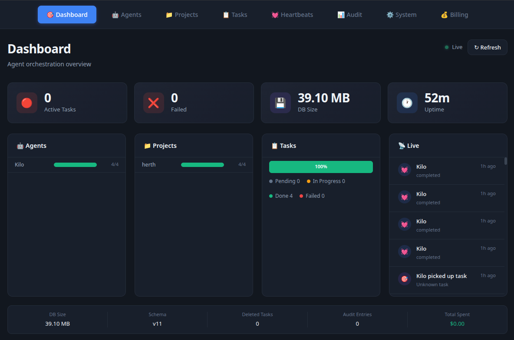

# ClawDesk — AI Agent Orchestration Platform




**ClawDesk runs specialist agents in parallel. They share a blackboard, push back on each other, and the swarm catches what a single pass misses.**

Use it when multiple interdependent decisions need to stay consistent — scientific research, game design, scenario planning, product definition, worldbuilding. One agent drafts, another spots holes, a third challenges assumptions. The blackboard is their shared reality.

## What it's for

ClawDesk is a multi-agent blackboard system. Specialist agents work in parallel, share a common workspace, and challenge each other's output. It's not a pipeline — it's a swarm.

**Good fits:**
- Scientific research — one agent explores, another fact-checks, a third synthesizes contradictions
- Game design — systems, narrative, balance, and lore agents all revising against each other
- Scenario planning — multiple analysts stress-testing the same plan from different angles
- Product definition — competing perspectives on features, users, and constraints
- Worldbuilding — cosmology, geography, species, and history agents keeping each other consistent

**How it works:**
1. Create a project and define specialist roles (or let agents auto-create them)
2. Agents read/write shared workspace files — no direct messaging needed
3. Tasks flow through a pull-based queue; agents pick up their own work on heartbeat
4. The swarm revises and expands until consensus stabilizes

## Quick Start

### 1. Clone & install

```bash
git clone https://github.com/glassrun/clawdesk.git
cd clawdesk
```

### 2. Backend

```bash
cd backend && npm install && npm start
# → http://localhost:3777
```

### 3. Frontend

```bash
cd frontend && npm install
cp .env.local.example .env.local   # edit IP if needed
npm run dev
# → http://localhost:3000
```

### 4. Start OpenClaw gateway

```bash
openclaw gateway start
```

Requires [OpenClaw](https://docs.openclaw.ai) installed.

## Frontend Configuration

The frontend reads two values from `frontend/.env.local`:

| Variable | Description |
|---|---|
| `NEXT_PUBLIC_API_URL` | Backend API URL (e.g. `http://192.168.1.100:3777`) |
| `ALLOWED_ORIGINS` | Comma-separated hosts allowed to access the dev server (e.g. `192.168.1.100,localhost`) |

Copy `.env.local.example` to `.env.local` and update the IP to match your machine.

## Features

### Dashboard
Four live panels: **Agents** (throughput bar), **Projects** (completion bars), **Tasks** (status stacked bar), **Live Activity** (real-time SSE feed).

### Projects
Create projects with optional **agent auto-creation** — when enabled, the executor prompt tells agents they can spawn sub-agents for parallel or specialized work.

### Tasks
- Assign to specific agents or leave unassigned for any agent to pick up
- Chain with `dependency_ids` for ordered execution
- Priority: low / medium / high
- Recurring tasks respawn automatically after completion
- Failed tasks auto-retry after 15-minute cooldown (max 3 attempts)
- Full input/output visible in task results panel

### Agent Auto-Creation
Projects with `creates_agent` enabled tell the executor prompt that sub-agents can be spawned via `POST /api/agents`. Agents create sub-agents when a task would benefit from parallel or specialized attention. Sub-agents are picked up by the scheduler automatically.

### Heartbeat Engine
- Ticks every second — wakes agents, they pull their own tasks
- Auto-resets stuck tasks (in_progress > 10 min → pending)
- Auto-retries failed tasks
- Dispatches recurring tasks on schedule

## Project Structure

```
clawdesk/
  backend/           # Node.js + Express API server
    server.js        # Entry point
    db.js            # SQLite with migrations
    routes/          # API route handlers (agents, tasks, projects, stream, system)
    services/        # Heartbeat engine, task executor, scheduler
    lib/             # Task handoff parsing
    data/            # SQLite database file
    public/          # Static files
  frontend/          # Next.js dashboard (responsive, mobile-friendly)
    src/app/         # Pages: dashboard, agents, projects, tasks, billing, system
  docs/              # Architecture docs
  skills/            # OpenClaw skill references
```

## Architecture

```
┌────────────────────────────────────────────────────────────────┐
│  LAYER 1: Shared Workspace                                     │
│  ~/clawdesk-projects/{project-slug}/                          │
│  Agents read/write shared files — no direct communication      │
└────────────────────────────────────────────────────────────────┘
                              ↓
┌────────────────────────────────────────────────────────────────┐
│  LAYER 2: Task Queue (pull-based scheduling)                   │
│  Tasks addressed to specific agents — not broadcast             │
│  Agents pull their own tasks on heartbeat tick                │
└────────────────────────────────────────────────────────────────┘
                              ↓
┌────────────────────────────────────────────────────────────────┐
│  LAYER 3: Heartbeat Engine (1-second tick)                    │
│  Wakes agents — does not assign or dispatch                    │
│  Auto-resets stuck tasks, auto-retries failed tasks            │
└────────────────────────────────────────────────────────────────┘
                              ↓
┌────────────────────────────────────────────────────────────────┐
│  LAYER 4: Agent Auto-Creation (optional, per-project)          │
│  Agents spawn sub-agents at runtime via API                    │
│  Scheduler picks up new agents automatically                   │
└────────────────────────────────────────────────────────────────┘
```

### Key design decisions

1. **No direct agent communication** — agents coordinate through artifacts in the shared workspace. Agent A writes a file, Agent B reads it later. No agent needs to know about any other agent.

2. **Pull-based scheduling** — the heartbeat tick wakes agents, agents pull their assigned tasks. The scheduler doesn't track agent state or push work.

3. **Dynamic task tree** — agents can spawn sub-agents and create tasks for other agents at runtime, growing the work graph dynamically.

4. **Per-project agent creation** — opt-in per project via the `creates_agent` checkbox at project creation time.